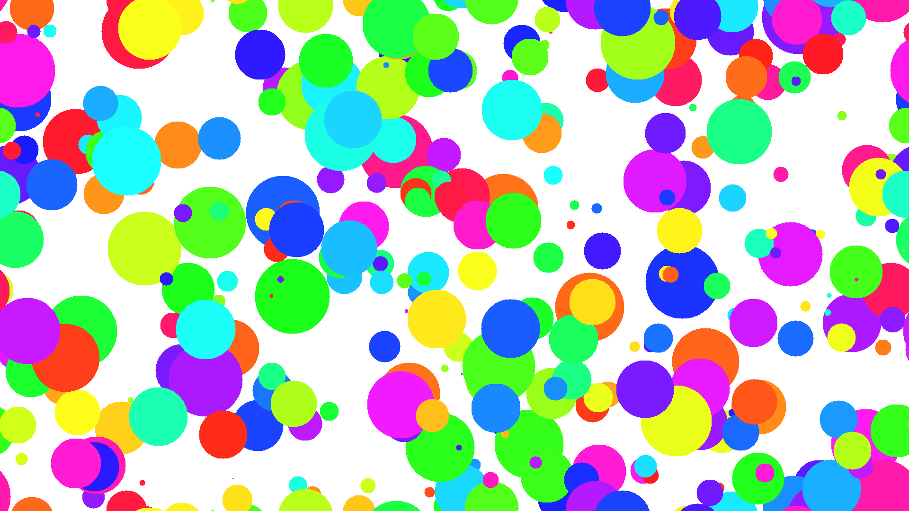

# Circles
Solution for a Concurrent Programming assignment.

The goal of the assignment question is to draw **c** amount of random circles of max radius **r** on a 1920px by 1080px image using two threads concurrently. To avoid race conditions, the following restriction is imposed: 

> Overlapping circles cannot be drawn at the same time by different threads, but non-overlapping circles are to be drawn concurrently.

View assignment details in [assig1.pdf](assig1.pdf) question 1.

The following image is an example png generated from [Main.java](/src/Main.java) with parameters **c = 300** and **r = 80px**.

